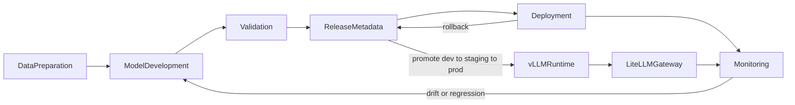

# MLOps-Platform

Hybrid ModelOps/MLOps platform scaffold for managing model artifacts, training,
evaluation, vLLM serving, gateway exposure, observability, promotion, and
rollback.

This repository was created from a reusable local model infrastructure scaffold,
but its product harness has been reset. Treat the current code as inherited
scaffold: future work should enter through feature intake, update product docs,
create story packets, and attach validation proof before making production-ready
claims.

## Intended Direction

```text
Source model or artifact
  -> training or conversion
  -> evaluation and benchmark proof
  -> model release metadata
  -> promotion to vLLM runtime
  -> gateway exposure
  -> observability and rollback
```

## MLOps Stages

The product contract for end-to-end stages and promotion is defined in
[`docs/product/model-release-lifecycle.md`](docs/product/model-release-lifecycle.md).

| Stage | Scope |
| --- | --- |
| Data preparation | Collection, cleaning, labeling, feature engineering, data versioning |
| Model development | Training, experiment tracking, hyperparameter tuning |
| Validation | Offline metrics, test set, bias checks, model registry entry |
| Deployment | Batch/online serving, CI/CD, canary/rollback |
| Monitoring | Data drift, model drift, performance, retraining triggers |

## Promotion Workflow

Promotion advances which model release is exposed through serving aliases, backed
by durable release metadata and validation evidence. This is the intended
direction; automation is not production-ready yet.



Promotion states: `draft` → `candidate` → `approved` → `promoted` → `retired`.
Environments: `dev` (experimentation), `staging` (production-like),
`prod` (external-facing, rollback required).

## How To Validate

Inherited scaffold is not production-ready. Run the harness validation ladder
before claiming behavior works:

| Command | When to use |
| --- | --- |
| `make validate-quick` | Bounded static checks; no running model services |
| `make test-integration` | Compose/config and contract checks |
| `make test-platform` | Live host validation on a prepared runtime host |
| `make release-check` | Release validation with selected artifacts on a GPU host |

Commands are registered in [`config/validation-commands.yaml`](config/validation-commands.yaml).
Proof expectations live in [`docs/TEST_MATRIX.md`](docs/TEST_MATRIX.md).

## Initial Surfaces

Architecture overview: [`docs/ARCHITECTURE.md`](docs/ARCHITECTURE.md).

- `models/`: model weights, manifests (`desired-models.yaml`, `presets.yaml`); tooling in `llm_local/models/`
- `training/`: local fine-tuning environments and scripts.
- `evaluation/`: latency and quality evaluation tooling.
- `serving/`: vLLM runtime and LiteLLM gateway configuration.
- `observation/`: Prometheus, Grafana, and report generation.
- `docs/`: harness, product contracts, story packets, decisions, and validation matrix.

## Harness Rule

Do not treat inherited scaffold as production-ready. Select a story, define the
contract, run the relevant validation ladder, and record evidence in the test
matrix before promoting behavior.

## Release Registry

Model promotion metadata and CLI:

```bash
./llm-local release create --id ID --name NAME --source MODEL_ID \
  --datasets train=ds1,val=ds2,test=ds3 --config-ref PATH
./llm-local release promote ID --to dev --apply-serving
```

See [`docs/product/model-releases.md`](docs/product/model-releases.md) and
[`docs/runbooks/release-promotion-vm.md`](docs/runbooks/release-promotion-vm.md).

## Continuous Training (MLflow + DVC)

```bash
./llm-local train mlflow up
./llm-local train pipeline run --dry-run   # CI / laptop
./llm-local train pipeline run             # GPU VM + S3 + MLflow
```

See [`docs/product/continuous-training.md`](docs/product/continuous-training.md).
