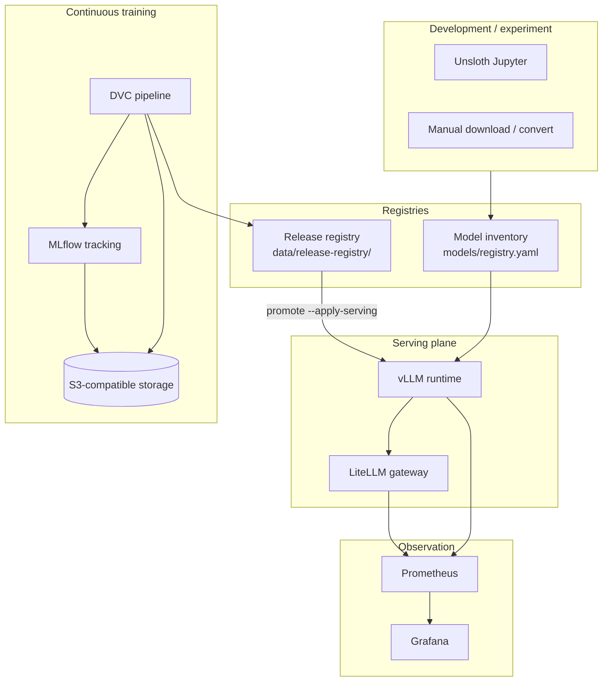

# Architecture — MLOps-Platform

This document describes the **current** repository architecture: how components
are organized, how data and control flow between them, and what is implemented
versus planned. Product behavior contracts live in `docs/product/`; this file
describes system shape and boundaries.

Last aligned with: US-001 (lifecycle), US-002 (release registry), US-003
(MLflow + DVC continuous training), US-004 (GPU train + Model Registry).

## Design goals

1. **Local-first, hybrid-ready** — develop and prove on a GPU VM; artifacts and
  metadata can live on S3-compatible storage.
2. **Separation of concerns** — model inventory, release promotion metadata,
  experiment tracking, and serving config are distinct stores with explicit
   handoffs.
3. **Harness-driven change** — behavior enters through stories and validation
  ladders; inherited scaffold is not production proof by default.
4. **Single control plane** — `llm_local` holds behavior; `./llm-local` is the
   thin operator CLI; Docker Compose runs workloads.

## System context




## Architectural planes


| Plane           | Responsibility                                     | Primary locations                                                    |
| --------------- | -------------------------------------------------- | -------------------------------------------------------------------- |
| **Control**     | CLI, validation, guardrails, compose orchestration | `llm_local/`, `llm-local`, `config/runtime-catalog.yaml`             |
| **Data**        | Weights, datasets, conversion                      | `models/`, `training/pipeline/data/`                                 |
| **Artifact**    | Checkpoints, eval reports, release records         | `training/pipeline/models/`, `evaluation/`, `data/release-registry/` |
| **Workload**    | Training, conversion, benchmark jobs               | `training/`, `evaluation/` (Docker Compose)                          |
| **Serving**     | Inference runtime and gateway                      | `serving/vllm/`, `serving/litellm/`                                  |
| **Observation** | Metrics, dashboards, batch reports, MLflow traces (US-005) | `observation/`, MLflow UI via `training/mlflow/` |


### Control plane (`llm_local/`)

All operator logic is a single Python package:

```text
llm_local/
  cli.py                 # ./llm-local entrypoint
  catalog.py             # Parse config/runtime-catalog.yaml
  compose.py             # Docker Compose up/down
  validation.py          # Validation ladder (quick / integration / platform / release)
  models/                # Inventory: download, registry, presets, manage (select/rm)
  pipeline/
    runner.py            # dvc repro / schedule wrappers
    stages/              # DVC stage implementations
      prepare_data.py
      train.py
      evaluate.py
      register.py
  releases/              # Promotion registry: schema, store, CLI, serving apply
  serving/
    tracing.py           # MLflow tracing config for LiteLLM (US-005)
  ops/
    preflight.py         # GPU, ports, health, model/runtime compatibility
    validate_evidence.py # Story evidence block validation
```

**Rule:** commands that mutate runtime state read `config/platform.yaml` and
`config/runtime-catalog.yaml`, then write `config/env/*.env` or restart containers.

### API boundaries

The repo exposes **one operator CLI** with many subcommands — not multiple
independent CLIs. Stability and reuse come from the Python package layer.

| Surface | Role | Stable contract? | Examples |
| --- | --- | --- | --- |
| **Operator CLI** | Human + runbook entry point | UX may change (rename/group commands) | `./llm-local release promote …` |
| **Programmatic API** | Business logic, tests, imports | Yes — prefer keeping modules stable | `llm_local.releases.store.ReleaseStore` |
| **Pipeline automation** | DVC/cron; bypasses CLI router | Stage module interfaces | `python -m llm_local.pipeline.stages.train` |
| **Makefile** | Shortcuts over the operator CLI | Optional; docs may reference either | `make validate-quick` |

```text
Operator / Makefile ──► ./llm-local (cli.py)     thin adapter — safe to reshape
Cron / DVC          ──► python -m llm_local…     automation — avoid shelling to llm-local
Tests / tools       ──► import llm_local.*       programmatic API — keep stable
```

**If a subcommand is removed later**, update docs, Makefile, and tests that
reference the command string. Core behavior remains as long as the underlying
`llm_local/` module is kept. Do not put business logic only in `cli.py`.

**When to add a subcommand:** repeated operator workflow with clear domain
(`release`, `train pipeline`, `serve`). **When not to:** one-off scripts,
pipeline internals, or config that belongs in `config/` only.

### Configuration plane (`config/`)

All operator-tunable settings are centralized under `config/`. See
`config/README.md` and the manifest `config/platform.yaml`.

| Path | Role |
| --- | --- |
| `platform.yaml` | Index of every config file and env profile |
| `runtime-catalog.yaml` | Services, images, ports, `env_profile` per service |
| `validation-commands.yaml` | Harness validation ladder |
| `models/desired-models.yaml` | Product model intent |
| `models/presets.yaml` | Serving presets |
| `pipeline/params.yaml` | Continuous training parameters (DVC) |
| `dvc/config.example` | S3 remote template |
| `litellm/config.yaml` | Gateway routing |
| `env/*.env.example` | Service env templates |
| `env/*.env` | Local overrides (gitignored) |

```bash
./llm-local config init    # copy env templates → config/env/*.env
```

Code resolves paths via `llm_local/config_paths.py`. Docker Compose loads
`--env-file config/env/<profile>.env` for each service.

### Data plane


| Store | Role | Durability | Git |
| --- | --- | --- | --- |
| `config/models/desired-models.yaml` | Product intent (which models to hold) | Committed | yes |
| `models/<id>/model.yaml` | Per-model sidecar (path, format, targets) | Local | ignored |
| `models/registry.yaml` | Assembled inventory (from sidecars) | Generated | ignored |
| `config/models/presets.yaml` | Serving preset definitions | Committed | yes |
| `training/pipeline/data/raw/` | Raw training inputs | DVC-tracked | partial |
| `training/pipeline/data/processed/` | Pipeline stage outputs | DVC-tracked | no |


Model weights and large artifacts are **not** product truth in git; lineage is
carried by sidecars, DVC manifests, MLflow runs, and release records.

### Release and inventory (two registries)


| Registry             | Purpose                                          | Path                     |
| -------------------- | ------------------------------------------------ | ------------------------ |
| **Model inventory**  | What exists locally, format, serving targets     | `models/registry.yaml`   |
| **Release registry** | Promotion state, lineage, eval refs, env aliases | `data/release-registry/` |


Promotion states: `draft` → `candidate` → `approved` → `promoted` → `retired`.  
Environments: `dev`, `staging`, `prod`.

See `docs/product/model-releases.md` and `docs/product/model-release-lifecycle.md`.

### Serving plane

Default online path:

```text
Client → LiteLLM (gateway aliases) → vLLM (OpenAI-compatible runtime)
```

- **vLLM** loads models from `/models` (host `models/` mounted).
- **LiteLLM** exposes stable aliases (e.g. `local-vllm`) mapped to vLLM.
- **Promotion** with `--apply-serving` calls `llm_local.models.manage` to select
the release's `source_artifact`, optionally restarts vLLM, and runs preflight.

Only **vLLM** is the promoted production runtime in the current catalog;
`safetensors` and `pytorch` formats map to `vllm` via `config/runtime-catalog.yaml`.

## Repository layout

```text
MLOps-Platform/
├── llm_local/              # Control plane (Python package)
├── llm-local               # Bash shim → python -m llm_local.cli
├── config/                 # All operator config (see config/README.md)
│   ├── platform.yaml           # Config manifest
│   ├── runtime-catalog.yaml
│   ├── validation-commands.yaml
│   ├── models/                 # desired-models, presets
│   ├── pipeline/params.yaml
│   ├── env/                    # per-service .env templates + local overrides
│   ├── litellm/config.yaml
│   └── dvc/config.example
├── models/                 # Weights + convert.sh only (manifests in config/)
├── training/
│   ├── pipeline/           # DVC: dvc.yaml, data/ (params in config/)
│   ├── mlflow/             # MLflow server compose
│   └── unsloth/            # Interactive GPU training environment
├── evaluation/             # Latency benchmark + lm-eval harness
├── serving/
│   ├── vllm/
│   └── litellm/
├── observation/            # Prometheus, Grafana, batch reports
├── data/release-registry/  # Gitignored release YAML + aliases + audit log
├── tests/                  # Unit + integration (release registry compose)
└── docs/                   # Harness, product contracts, stories, ADRs
```

## Technology stack


| Layer                  | Technology                         | Notes                                 |
| ---------------------- | ---------------------------------- | ------------------------------------- |
| CLI / control plane    | Python 3.13, `llm_local`           | Installed via `uv sync`               |
| Container runtime      | Docker Compose                     | Shared network `llm-net`              |
| Inference              | vLLM OpenAI API image              | GPU required                          |
| Gateway                | LiteLLM                            | API key auth, model routing           |
| Training (interactive) | Unsloth container                  | Jupyter + GPU                         |
| Training (automated)   | DVC pipeline + Python stages       | No Airflow/Prefect                    |
| Experiment tracking    | MLflow 3.14.0 (DHI)                | Local: Postgres + MinIO; prod: S3 |
| Data versioning        | DVC                                | S3-compatible remote                  |
| Scheduling             | cron via `train pipeline schedule` | Optional daily trigger                |
| Model download         | Hugging Face Hub                   | `llm_local.models.download`           |
| Conversion             | llama.cpp (`models/convert.sh`)    | HF → GGUF (`hf2gguf` only)            |
| Observability          | Prometheus + Grafana               | GPU exporter optional                 |
| Release storage        | YAML files                         | Override with `RELEASE_REGISTRY_ROOT` |


**Not in scope (current repo):** Airflow, Kubeflow Pipelines, Kubernetes
operators, feature store, automated drift-triggered retrain.

## End-to-end flows

### 1. Continuous training (US-003)

```text
Trigger: dvc repro (data/params change) OR cron → llm-local train pipeline run
  → prepare_data   → dataset_manifest.json
  → train          → run_manifest.json (+ MLflow run when configured)
  → evaluate       → ct_eval_report.json
  → register       → draft release in release registry + release_pointer.json
Operator: attach-eval → submit → approve → promote --to dev [--apply-serving]
```

Orchestration is **DVC stage DAG**, not a separate workflow engine. See
`docs/decisions/002-mlflow-dvc-s3-continuous-training.md`.

`train.dry_run: true` in `config/pipeline/params.yaml` allows CI/laptop runs without GPU;
real weights require a GPU VM and `train.dry_run: false`.

### 2. Manual model onboarding

```text
llm-local model download <repo> → sidecar model.yaml → assemble registry.yaml
Optional: models/convert.sh hf2gguf <dir>
llm-local config init
llm-local preset add / apply → config render → config/env/*.env
llm-local serve vllm up && serve litellm up
```

### 3. Release promotion (US-002)

```text
llm-local release create … → draft
llm-local release attach-eval … → submit → approve
llm-local release promote ID --to <env> [--apply-serving]
  → updates alias YAML (dev/staging/prod)
  → select model in vLLM + health check + preflight
llm-local release rollback --env <env> [--apply-serving]
```

### 4. Evaluation


| Type                 | Entry                         | Output                             |
| -------------------- | ----------------------------- | ---------------------------------- |
| Latency / throughput | `llm-local eval run`          | Benchmark JSON under `evaluation/` |
| Quality (lm-eval)    | `llm-local eval quality`      | Harness output                     |
| CT gate              | `pipeline/stages/evaluate.py` | `ct_eval_report.json`              |


### 5. Validation harness

Ladder levels (see `config/validation-commands.yaml`):


| Command                 | Scope                                                   |
| ----------------------- | ------------------------------------------------------- |
| `make validate-quick`   | Static syntax, compose config, catalog consistency      |
| `make test-integration` | Contracts + compose integration (e.g. release registry) |
| `make test-platform`    | Live services on prepared GPU host                      |
| `make release-check`    | Strict registry + runtime checks for release proof      |


Proof expectations: `docs/TEST_MATRIX.md`.

## Runtime catalog

`config/runtime-catalog.yaml` is the **single service registry** for:

- Compose file paths and container names
- Image defaults and port env vars
- GPU policy per service
- Format → compatible runtime mapping
- Health-check endpoints for platform/release validation

Groups: `serving`, `training`, `evaluation`, `observation`.

## State and dependency rules

1. **Product docs** define intended behavior; **stories** define selected slices.
2. **Generated local state** (`config/env/*.env`, `models/registry.yaml`, DVC outs) is not durable
  product truth without a committed contract or release record.
3. **Promotion** advances release metadata first; serving changes are explicit
  (`--apply-serving` or preset render).
4. **S3 / MLflow / DVC remote** must be provisioned before end-to-end CT works
  on cloud storage (see `training/pipeline/.dvc/config.example`).
5. **Production-ready claims** require evidence in `docs/TEST_MATRIX.md`.

## Implementation status


| Capability                              | Status                         | Story     |
| --------------------------------------- | ------------------------------ | --------- |
| Lifecycle + promotion contract          | documented                     | US-001    |
| File-based release registry + CLI       | implemented                    | US-002    |
| Promote/rollback → vLLM serving         | implemented (VM proof pending) | US-002    |
| DVC pipeline (4 stages)                 | implemented                    | US-003    |
| MLflow server compose                   | implemented                    | US-003    |
| Cron scheduler hook                     | implemented                    | US-003    |
| Real Unsloth fine-tune in `train` stage | implemented                    | US-004    |
| Auto-promote after eval gates           | not implemented                | backlog   |
| Monitoring → retrain trigger            | not implemented                | backlog   |
| Airflow / workflow orchestrator         | not planned (current phase)    | —         |


## Deferred / open decisions

- External artifact checksum policy and long-term object storage layout (M02).
- Default quality gates and per-domain metric thresholds.
- Production alias policy, canary knobs, and formal SLOs.
- When to introduce a workflow engine (Airflow/Prefect) if pipeline count grows.

Record new architectural choices in `docs/decisions/`.

## Related documents


| Document                                                  | Content                 |
| --------------------------------------------------------- | ----------------------- |
| `docs/product/domains.md`                                 | Product domain map      |
| `docs/product/model-release-lifecycle.md`                 | Stage taxonomy          |
| `docs/product/model-releases.md`                          | Release schema + CLI    |
| `docs/product/continuous-training.md`                     | CT commands + handoff   |
| `docs/product/data-versioning.md`                         | DVC remote + triggers   |
| `docs/product/experiment-tracking.md`                     | MLflow setup            |
| `docs/decisions/002-mlflow-dvc-s3-continuous-training.md` | CT stack ADR            |
| `docs/runbooks/release-promotion-vm.md`                   | GPU VM promotion proof  |
| `docs/TEST_MATRIX.md`                                     | Validation proof matrix |
