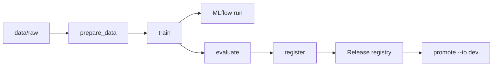

# Continuous Training — MLOps-Platform

## Flow

```text
Data change (DVC) or schedule (cron)
  -> dvc repro (prepare_data -> train -> evaluate -> register)
  -> MLflow run + model version
  -> Release registry candidate (draft/candidate)
  -> (manual or automated) eval gates + promote to dev on GPU VM
```



## Commands

```bash
# Start MLflow tracking server (S3 artifacts)
./llm-local train mlflow up

# Initialize DVC remote (first time on host)
cp training/pipeline/.dvc/config.example training/pipeline/.dvc/config
# edit bucket URL, set AWS_* env vars

# Run full continuous training pipeline
./llm-local train pipeline run

# Data-only repro (when raw data or params change)
./llm-local train pipeline repro

# Install example cron (daily 02:00)
./llm-local train pipeline schedule --install-cron
```

## Prerequisites

- S3 bucket (or MinIO) with credentials in environment
- GPU VM for real `train` stage (Unsloth container optional; pipeline supports `--dry-run` for CI)
- MLflow server running
- DVC remote configured

## Promotion handoff

The `register` stage creates a **draft** release with:

- `dataset_versions` from DVC manifest
- `training_config_ref` → `params.yaml` + MLflow run ID
- `eval_report_ref` → pipeline eval output

Operator flow after successful CT run:

```bash
./llm-local release submit <release_id>
./llm-local release approve <release_id>
./llm-local release promote <release_id> --to dev --apply-serving
```

See [`docs/runbooks/release-promotion-vm.md`](../runbooks/release-promotion-vm.md).

## Status

| Piece | Status |
| --- | --- |
| DVC pipeline definition | implemented (US-003) |
| MLflow server compose | implemented (US-003) |
| S3 remote config template | implemented (US-003) |
| Scheduler hook | implemented (US-003) |
| Unsloth GPU training integration | stub/dry-run; wire real trainer in follow-up story |
