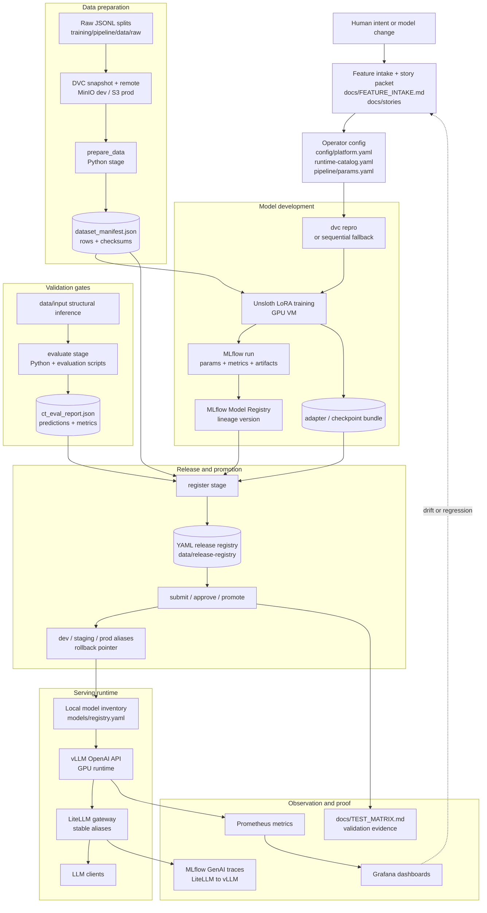

# MLOps Workflow and Tech Stack

This is the visual operating flow for the current repo. It shows intended
handoffs, implemented stack choices, and the feedback loop without introducing a
separate workflow engine.

## Stack by Stage

| Stage | Repo surface | Tech stack |
| --- | --- | --- |
| Harness intake | `docs/FEATURE_INTAKE.md`, `docs/stories/`, `docs/TEST_MATRIX.md` | Markdown contracts, Makefile validation ladder |
| Control plane | `llm_local/`, `./llm-local` | Python package + thin shell entrypoint, `uv` environment |
| Configuration | `config/` | YAML manifests, env templates, Docker Compose env files |
| Data versioning | `training/pipeline/data/`, `config/dvc/config.example` | DVC, JSONL manifests, MinIO for dev, S3 for prod |
| Training | `training/pipeline/`, `training/unsloth/` | DVC stages, Python stage modules, Unsloth, GPU VM |
| Experiment tracking | `training/mlflow/` | MLflow 3.x, Postgres metadata, S3-compatible artifact store |
| Evaluation | `evaluation/`, `llm_local/pipeline/stages/evaluate.py` | Python structural checks, benchmark scripts, optional lm-eval |
| Release registry | `llm_local/releases/`, `data/release-registry/` | YAML release records, aliases, audit log |
| Serving | `serving/vllm/`, `serving/litellm/` | vLLM OpenAI API runtime, LiteLLM gateway, Docker Compose |
| Observability | `observation/`, `config/mlflow-genai.yaml` | Prometheus, Grafana, optional GPU exporter, MLflow traces |

## Current Boundaries

- DVC is the workflow DAG for this phase; Airflow, Prefect, Kubeflow, and
  Kubernetes operators are not part of the current stack.
- MLflow tracks runs, artifacts, model versions, traces, and future GenAI eval;
  promotion still happens through the release registry.
- Serving promotion changes release metadata first. Runtime changes require
  `--apply-serving` or explicit config rendering.
